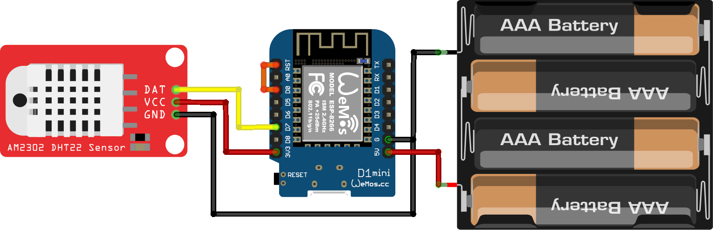

# Components

* [AM2302 DHT22 Humidity and Temperature Sensor Module](https://www.aliexpress.com/item/High-Precision-AM2302-DHT22-Digital-Temperature-Humidity-Sensor-Module-For-arduino-Uno-R3/32759158558.html)
* [Wemos D1 Mini ESP8266 Main Board (Clone)](https://www.jaycar.com.au/wifi-mini-esp8266-main-board/p/XC3802)
* [4x AA Switched Battery Enclosure](https://www.jaycar.com.au/4aa-switched-battery-enclosure/p/PH9282)

# Circuit

* Connecting the 4x AA batteries (max 6v) to the 5v pin appears to be safe enough. The main board regulates the ESP8266 chip and 3.3v pin to 3.3v safely.
* The AM2302 board can be connected to the main board directly, as it contains the necessary "pull up" resistor to get a strong signal from the DHT22 module.
* The code's "deep sleep" functionality causes the arduino to power-down until an internal timer fires a pulse on pin `D0`, which must be connected to the `rst` pin in order for the main board to wake up.

# Code
## Dependencies
These need to be installed as libraries accessible to the Arduino IDE.
* Arduino ESP8266 Libraries. If you have an ESP8266 set up with Arduino IDE, you probably have this. I followed instructions from [here](https://www.jaycar.com.au/medias/sys_master/images/9205492940830/XC3802-manualMain.pdf).
* [PubSubClient](https://github.com/knolleary/pubsubclient) for MQTT
* [Adafruit DHT Sensor Library](https://github.com/adafruit/DHT-sensor-library/), which also requires the [Adafruit Unified Sensor Library](https://github.com/adafruit/Adafruit_Sensor)

# Caddy

Source [.blend](caddy.blend) file can be modified in [Blender](https://blender.org), otherwise the [.stl](caddy.stl) is ready to print.
